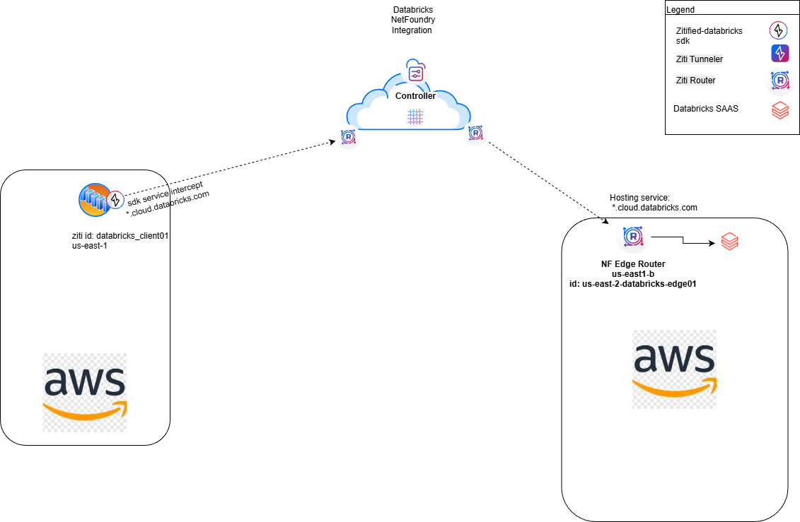
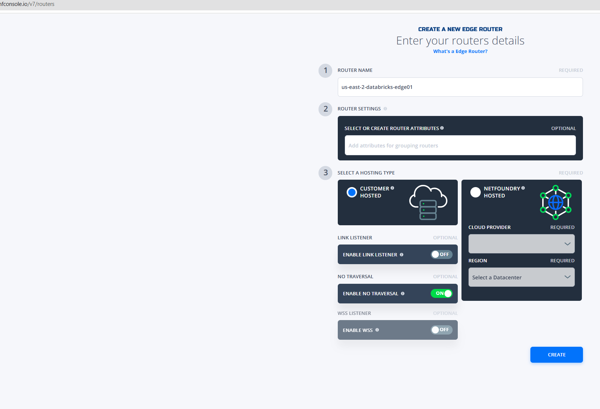
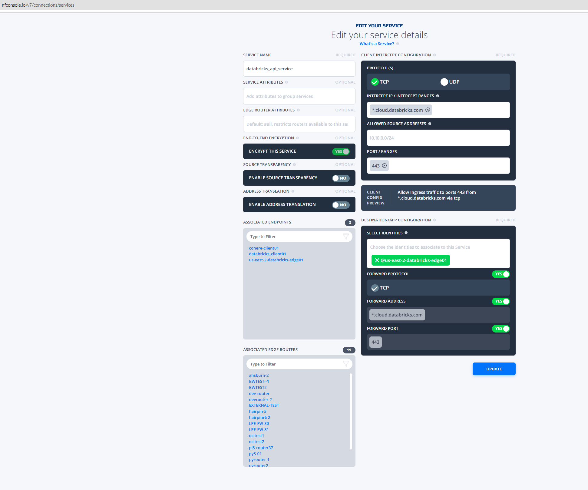
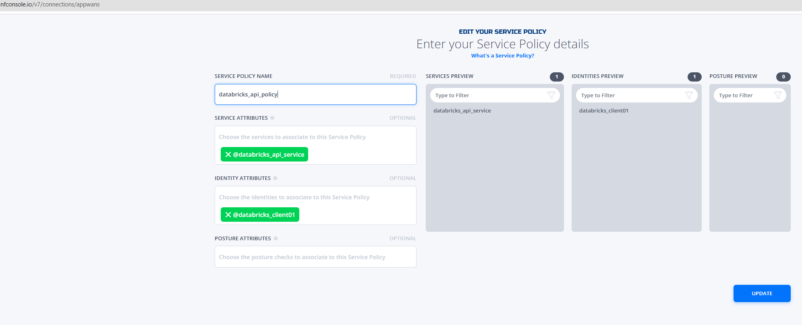
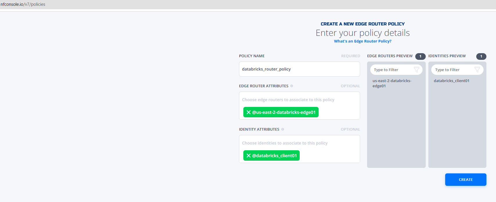

## zitified-databricks

`zitified-databricks provides an example of zitifying the Databricks API Python SDK to encapsulate Databricks and mlflow API
calls over a NetFoundry Zero Trust Overlay.  This demo assumes you are using a new free databricks account, adjust as necessary
for your environment.`

## Setup and Configure the Example



Create or use an existing ziti network with at least one NF hosted edge router. This can be accomplished using the NetFoundry
Console.


1. Create an ubuntu 24.04 vm in AWS or other location with internet access
   a. install prereqs 

      ```sudo apt update```

      ```sudo apt upgrade```

      ```sudo apt install python3-pip python3-venv git```

   b. ## Build the Example
      On the linux system that will run the Client
      clone the repo
      mkdir ~/repos
      cd ~/repos
      ```git clone https://github.com/netfoundry/zitified-databricks.git```
      cd zitified-databricks/src

2. Create and enroll a ziti identity place the identity json file in the ~/repos/zitified-databricks/src on the VM created in step 1.
   ```
   a. databricks_client01
   ```

2. Add a customer hosted edge router "us-east-2-databricks-edge01" to your network



4. Launch the customer hosted edge-router in aws us-east-2 follow: https://support.netfoundry.io/hc/en-us/articles/360016342971-Deployment-Guide-for-AWS-Edge-Routers 
 

3. Create a NF service named "databricks_api_service" and use wildcard address "*.cloud.databricks.com" , protocol TCP and 443 as the
   port. Assign the router identity e.g. us-east-2-databricks-edge01 as the hosting entity and forward address, protocol and port to yes.



5. Create a service policy to bind the identity to the NF service e.g.



6. Create a router policy and with the NF hosted edge-router and the databricks_client as the identity e.g.




4. On the VM created in step one, send a chat command via using zdatab.py e.g.

   a. Create a python virtual environment

      ```cd ~/repos/zitified-databricks/src```

      ```python3 -m venv databricks```

      ```source databricks/bin/activate```

   b. Install openziti and databricks modules

      ```pip3 install openziti```

      ```pip3 install databricks.sdk```

      ```pip3 install mlflow```

   c. create a databricks config file ~/.databrickscfg with the following contents
      ```
      [free-profile]
      host = https://<workspace-prefix>.cloud.databricks.com #Your workspace url
      token = dapiXXXXXXXXXXXXXXXXXXXX #Your Generated PAT
      ```
   d. Execute the script 

   ```python3 zdatab.py --ziti-identity datab_client.json --csv-file iris.csv```
   

   Sample output:

   ```
   Loading the OpenZiti identity...
   Created new volume: /Volumes/workspace/default/datafiles/
   Volume info: datafiles VolumeType.MANAGED s3://dbstorage-prod-XXXXXX
   Uploading ../iris.csv to volume at /Volumes/workspace/default/datafiles/...
   Created new experiment: ID=2132455470009262
   Created Job: name=demo-job
   List jobs:
   Number of jobs: 1
   demo-job
   ```
